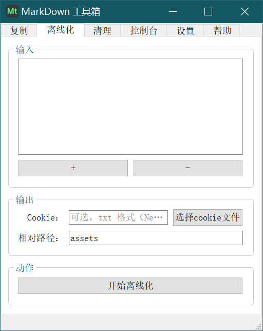
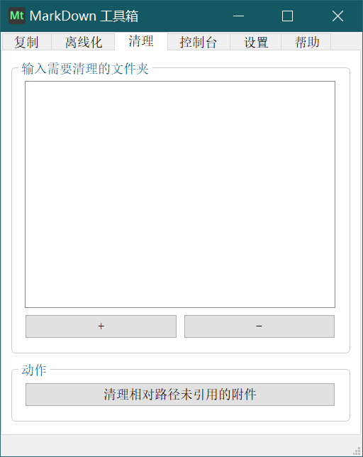

#   Markdown 工具箱

> 更新日期：2020 年 10 月 4 日

## 🚩 简介

Markdown 工具箱，是我为 Markdown 笔记管理做的一个工具集。目前有以下几个功能：

- **复制**

  批量将 md 笔记（连带它的相对路径引用的图片、附件）复制或移动到另一指定的文件夹

- **离线化**

  批量将 md 笔记中的在线图片、附件、绝对路径引用的文件下载或移动到笔记的相对路径文件夹中，并将原始笔记中原来的绝对路径改为相对路径

- **清理**

  批量清理 Markdown 相对路径索引的文件夹中已不再被引用的图片

仓库地址：[Gitee](https://gitee.com/haujet/Markdown-Toolbox) 和 [GitHub](https://github.com/HaujetZhao/Markdown-Toolbox) 

## 👍 安装和使用方式

已发布到 pypi 上，安装 python3 后，使用 `pip install Markdown-Toolbox` 即可安装，再使用 `MarkdownToolbox` 或 `Markdown-Toolbox` 命令就可以启动了。

你也可以将仓库克隆到本地，在 `src` 文件夹内，先使用 `pip install -r requirements.txt` 安装依赖后，使用 `python __init__.py` 启动。

有空的话我会打包 Win64 的 exe 版本到发行界面。

## 🔮 软件界面

## 📝 开发背景

### 为了方便地整理 md 文档

我不信任任何图床，但是 TextBundle 还没有普及，所以目前我在做 Markdown 笔记的时候，会把图片都放到 md 文档同目录下的 assets 文件夹，用相对路径引用图片。

但这就带来一个问题：一个目录下所有笔记的图片都在同一个 assets 目录下，如果我想要整理下笔记，将其中几份笔记移动到另一个文件夹，因为所有图片使用的是相对路径，我就需要将所有引用到的图片都一并复制过去。

而如果要从存有上百张、上千张图片的 assets 文件夹中找到要移动的文档所引用的所有图片，是非常困难的；而如果一股脑将整个 assets 文件夹复制过去，必然会造成磁盘空间浪费。

这就是 Markdown 的通病：

* 图片用图床吧，网络会影响体验，图床也难保几十年地靠谱
* 图片用本地绝对路径吧，分享文档到其它设备，就看不了图了
* 图片用本地相对路径吧，多个文档共用一个图片目录的话，后期整理和分享也都不方便

不过我还是坚持 md 笔记使用本地相对路径的图片，为了方便整理文档，就写了这个工具，第一个功能是 **复制**，用于移动文档的同时自动移动文档中索引的相对路径的图片、附件。

### 为了离线网络文章的图片

通过一些（例如简悦）浏览器插件可以将网络上的文章保存为 md 格式，不过里面的图片仍然是在线链接，如果这些文章很棒，为了避免其中的图片链接失效，就需要将其下载下来。

另外，虽然将网页上的文章复制到 Typora 等编辑器也可以直接将图片下载下来，但也有以下不足：

- 不能批量操作
- 对有些为了防爬虫而要求 cookies 的网站的图片无法成功下载
- 对有些为了防外链而对 Headers 有要求的网站的图片无法成功下载

还有在我将 **mp4、mp3** 等文件拖入 Typora 时，Typora 也不会将这些文件自动复制到 `assets` 目录。

所以做了 **离线化** 这个功能，方便批量地将所有文档中引用到的附件、图片放到相对路径中引用。

### 为了清理图片垃圾

在 Typora 中，例如我截了一张图，粘贴进去，这张图片就会被自动保存到相对路径的 `assets` 目录，但是，如果我将这个图片从文档中删掉，删掉的只是它的引用路径，实际图片文件仍然在 `assets` 目录中保存着，长久以往，assets 中必然会有许多没有被引用但是仍占据空间的垃圾文件，它们混杂在被正常引用的文件中，很难一一删掉。

所以我做了这个清理功能，原理是：

​	对指定文件夹，得到这个文件夹下所有的 md 文档（不递归），从所有的文档中统计都有哪些正在被以相对路径引用的图片和附件，并找到这些图片和附件的所在文件夹，得到这些附件文件夹中所有的文件，再一一比对哪些文件没有被上述找到的 md 文档引用，统一移动到同级 `未引用附件` 文件夹中，在弹出对话框经用户确认后删除它们。

## ✨ 特性

* Python3 用 Pyside2 写的，对于 Linux、MacOS、Windows 系统，只要装了 Python3 就能用。
* 我是个编程渣渣，用不惯英文变量（不会起名，阅读理解的速度也慢），程序里的大部分变量都是中文
* 没有精力做英文版本

## ☕ 打赏

万水千山总是情，一块几块都是情。本软件完全开源，用爱发电，如果你愿意，可以以打赏的方式支持我一下：

## 😀 交流

如果有软件方面的反馈可以提交 issues，或者加入 QQ 群：[1146626791](https://qm.qq.com/cgi-bin/qm/qr?k=DgiFh5cclAElnELH4mOxqWUBxReyEVpm&jump_from=webapi) 

